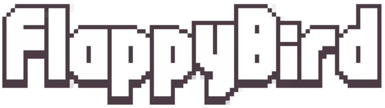
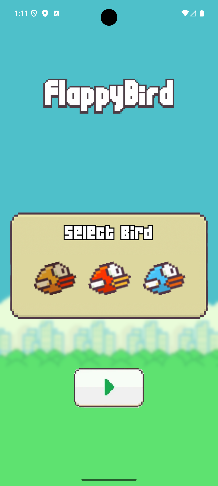
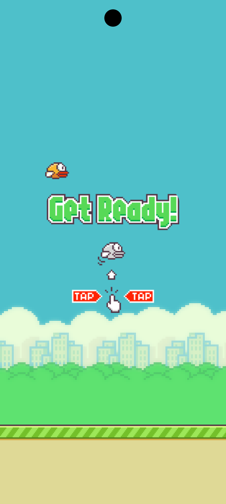
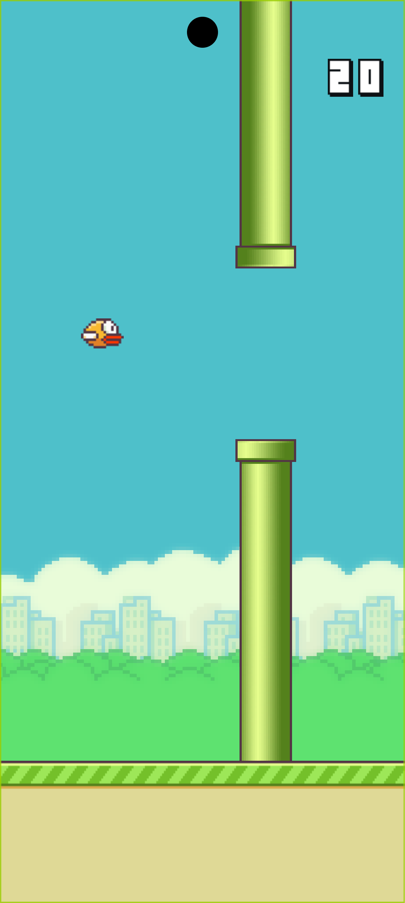
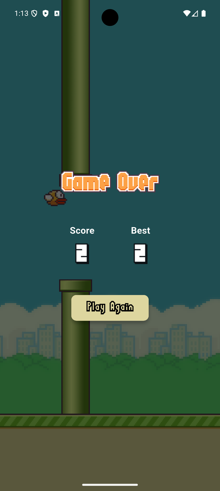

A classic Flappy Bird game built with Flutter and the Flame engine.

## 🌟 Features

- **Classic Flappy Bird Gameplay** – Tap the screen to make the bird fly and navigate through the pipes.  
- **Score Tracking** – Earn points for each pipe you successfully pass.  
- **High Score** – Your best score is saved and displayed on the game over screen.  
- **Game Over and Restart** – Colliding with a pipe or the ground ends the game; restart to try again.  
- **Flame Engine Powered** – Uses Flame for the game loop, physics, and component management.  
- **Provider for State Management** – Manages game state like score and game over status.  

## 📸 Screenshots

| Bird Selection | Ready Screen | Gameplay | Game Over |
| :---: | :---: | :---: | :---: |
|  |  |  |  |


## 📦 Getting Started

Follow these steps to run the project locally:

1. **Clone the repository**
```bash
   git clone https://github.com/anees7757/flappy_bird.git
   cd flappy_bird
```

2. **Open the project** in your preferred IDE (e.g., VS Code, Android Studio)

3. **Install dependencies**
```bash
   flutter pub get
```

4. **Run the app**
```bash
   flutter run
```

## 📄 License

This project is licensed under the MIT License - see the LICENSE file for details.

## ⭐ Show your support

Give a ⭐️ if you enjoyed this project!

---

Made with ❤️ and Flutter
